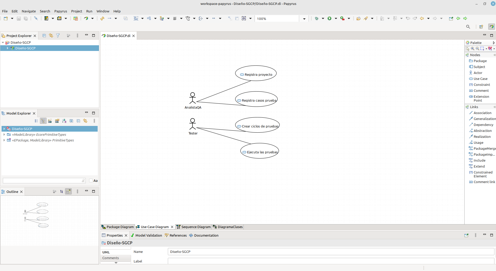
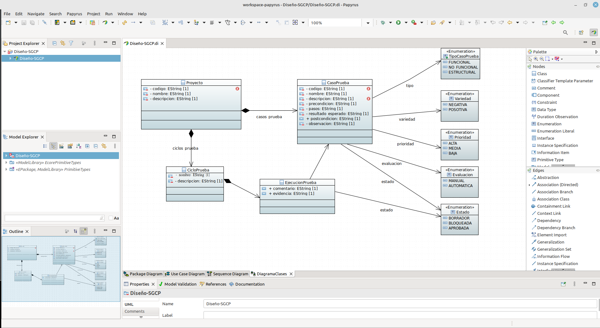
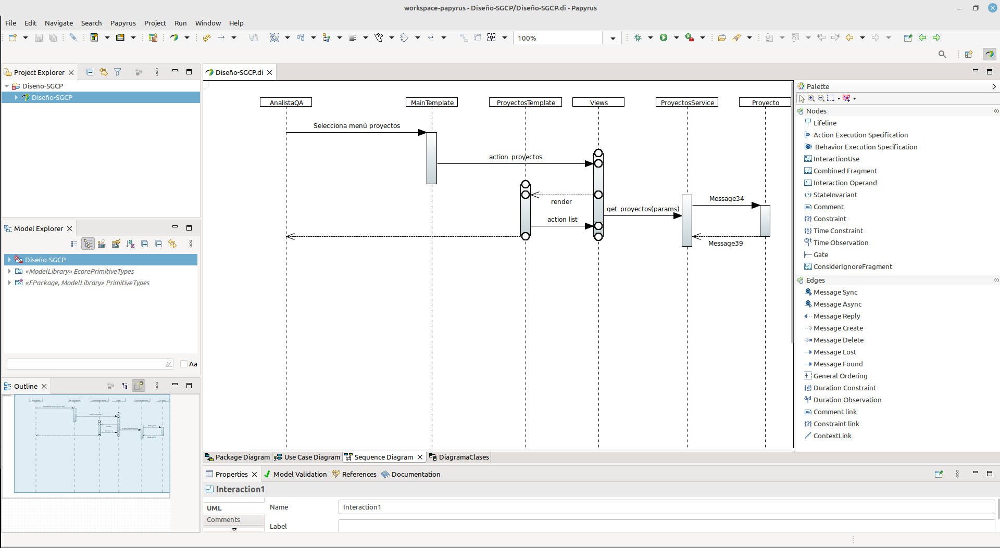

# chat-papyrus

## Datoss
- Por: Danny Emanuel Muñoz Flores
- Tema: Modelado con Papyrus, para el proyecto "Sistema de Gestión de Caso de Prueba"

## Diagrama de casos de uso

## Diagrama de clases

## Diagrama de secuencia

¡Saludos!
